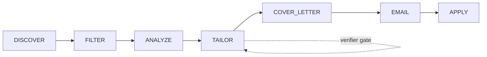

# InternApply

**Automated internship application system for paid backend internships.**

InternApply discovers internship listings, tailors your resume for each role,
generates cover letters, finds hiring manager emails, and submits applications
on Internshala. It uses a LangGraph pipeline with an LLM at its core and a
deterministic verifier gate to prevent hallucination.

- Discovers listings from **Internshala** and **Naukri** (HTTP scraping, no API keys needed)
- Uses an **LLM** (OpenCode Go) to analyze job descriptions and tailor resumes
- Runs every tailored resume through a **deterministic verifier gate** (6 checks, no LLM)
- Generates **humanized cover letters** with scoring and regeneration
- Finds hiring manager emails via **Hunter.io**
- Sends cold emails through the **Gmail API** (encrypted tokens, `--approve` gate)
- **Auto-applies** on Internshala via Playwright
- **ATS scores** every tailored resume (deterministic, no LLM)
- Stores everything in **SQLite** with checkpointing for resume and retry



---

## Quick Start

```bash
# 1. Clone and install
git clone https://github.com/your-username/internapply.git
cd internapply
pip install -e .

# 2. Set up your API keys
cp .env.example .env
# Edit .env with your OPENCODE_GO_API_KEY

# 3. Import your resume
internapply resume init

# 4. Find internships
internapply discover --dry-run

# 5. Run the full pipeline
internapply run --dry-run
```

---

## Pipeline Stages

```
DISCOVER → FILTER → ANALYZE → TAILOR → COVER LETTER → EMAIL → APPLY
```

| Stage | What it does |
|---|---|
| **DISCOVER** | Scrapes Internshala and Naukri for internship listings matching your keywords and locations. No API keys required (server-rendered HTML). |
| **FILTER** | Removes unpaid listings, jobs below `MIN_STIPEND_INR`, non-matching locations, and duplicates by URL. |
| **ANALYZE** | Uses the LLM to extract structured requirements from each job description: required skills, nice-to-haves, responsibilities, technologies, and a match score against your resume. Falls back to deterministic keyword matching if the LLM is unavailable. |
| **TAILOR** | Rewrites your resume summary, reorders projects and skills, and rephrases bullet points to match the job description. Every output runs through the **verifier gate** (up to 3 attempts). |
| **COVER LETTER** | Generates a cold email draft, then runs it through a humanization pipeline that strips cliches, removes robotic phrasing, and scores it (0-100). Regenerates if the score is below 80. |
| **EMAIL** | Finds hiring manager emails via Hunter.io, generates a personalized draft, and saves it locally. No email is sent without the `--approve` flag. |
| **APPLY** | Uses Playwright to navigate Internshala listing pages, fill the application form with your tailored resume and cover letter, and submit. Naukri jobs are skipped (portal submission only works for Internshala). |

---

## CLI Commands

### `internapply resume`

Manage your master resume (stored in `profile/resume.json`).

```
internapply resume init                          Parse JS resume generator → JSON
internapply resume show                          Display current resume
internapply resume add-skill "Backend: FastAPI"  Add a skill
internapply resume add-project "MyApp"           Add a project
internapply resume edit                          Open resume in $EDITOR
internapply resume refresh                       Re-parse JS file after edits
```

### `internapply discover`

Find internship listings.

```
internapply discover                                      Default search
internapply discover --keywords "python,rust" --locations "Remote"
internapply discover --dry-run                            Simulate (uses mock data)
internapply discover --max-jobs 100                       Limit results
internapply discover --no-save                            Don't write to DB
```

### `internapply tailor`

Tailor your resume for a specific job.

```
internapply tailor "Backend Intern" "Stripe" --jd-file description.txt
internapply tailor --job-id 42                            Load job from DB
internapply tailor "SDE Intern" "Google" --no-verify      Skip verifier gate
echo "Looking for a Python intern..." | internapply tailor "SDE Intern" "Google"
```

### `internapply run`

Execute the full pipeline.

```
internapply run                                           Full execution
internapply run --dry-run                                 Simulate everything
internapply run --max-jobs 10                             Process only 10 jobs
internapply run --from-stage tailor                       Resume from a stage
```

### `internapply email`

Manage email sending (Gmail API).

```
internapply email setup                                   OAuth2 authentication
internapply email list                                    Show pending approvals
internapply email send --job-id 42 --approve              Send one email
internapply email send --all --approve                    Send all pending
internapply email draft --job-id 42                       Preview without sending
internapply email status                                  Check quota and token
```

### `internapply status`

Show pipeline statistics, database summary, and active configuration.

---

## Anti-Hallucination Guarantee

The biggest risk with LLM-generated resumes is fabrication. InternApply solves
this with a deterministic verifier gate.

### How it works

After the LLM tailors a resume, the `ResumeVerifier` runs **6 checks** against
the source resume. Every check uses **set-based string matching only**:
no LLM calls, no API keys, no black-box scoring.

| Check | What it prevents | Severity |
|---|---|---|
| **Project names** | LLM invents a project you never worked on | Error |
| **Skills** | LLM adds a skill that isn't in your resume | Error |
| **Dates** | LLM fabricates or shifts timeline entries | Error |
| **Metrics** | LLM inflates numbers (40% → 99.5%, $10k → $2M) | Error |
| **Education** | LLM adds fake degrees, institutions, or GPAs | Error |
| **Cliches** | LLM fills in hollow AI phrases ("team player", "synergy") | Warning |

The score starts at 100 and drops by 20 points per error. If the score is below
60, the pipeline retries tailoring (up to 2 additional attempts) with explicit
feedback about what went wrong.

### Humanization pass for cover letters

Cover letters go through a second deterministic pipeline that:

- Strips AI cliche phrases ("passionate about", "proven track record", "synergy")
- Replaces robotic phrasing ("I am writing to apply" → removed)
- Removes hedging language ("just", "maybe", "perhaps")
- Eliminates submissive language ("sorry to bother", "if you don't mind")
- Scores 5 criteria (cliches, sentence variety, hedging, tone, word count)

If the score is below 80, the letter is regenerated with specific feedback.

### The `--approve` gate

No email is ever sent through the Gmail API without the `--approve` flag.
This is a hard requirement enforced at the CLI level. The `email send` command
also lists every recipient and asks for confirmation before dispatching.

---

## Architecture

### LangGraph orchestration

The pipeline is a `StateGraph` with 7 nodes connected in a linear topology.
Each node is an async function that reads and writes to a shared `PipelineState`
dict. The graph is compiled with in-memory checkpointing (via `MemorySaver`),
so you can resume from any stage using `--from-stage`.

### SQLite persistence

All job listings, applications, resumes, and email lookups are stored in a
local SQLite database (`data/internapply.db`). SQLAlchemy async handles
connection pooling. A migration system uses a schema version table.

### Secure token storage

Gmail OAuth tokens are encrypted at rest using `cryptography.fernet`. The
encryption key is derived from the machine ID and an optional passphrase.
This means a stolen token file cannot be used on a different machine.

### Rate limiting

- **LLM calls**: Token-bucket rate limiter at 30 calls per minute
- **Email sends**: 20 per day per Gmail account (configurable)
- **Internshala auto-apply**: 3-5 minute delays between submissions
- **Hunter.io**: Respects the free tier limit (~50 requests/month)

### Structured logging

All pipeline nodes log timing, item counts, and error details via `loguru`.
Configuration and API keys are logged once at startup (with secrets masked).

---

## Configuration

All configuration is via environment variables or a `.env` file in the project
root.

### Required

| Variable | Description |
|---|---|
| `OPENCODE_GO_API_KEY` | OpenCode Go API key for LLM calls |
| `OPENCODE_GO_MODEL` | Model identifier (default: `opencode-go/deepseek-v4-flash`) |
| `OPENCODE_GO_BASE_URL` | API endpoint (default: `https://opencode.ai/zen/go/v1`) |

### Optional: Email

| Variable | Description |
|---|---|
| `HUNTER_API_KEY` | Hunter.io API key for email discovery (free tier: 50 searches/month) |
| `GMAIL_SENDER_EMAIL` | Gmail address to send from |
| `GMAIL_CLIENT_SECRET_PATH` | Path to Gmail OAuth `client_secret.json` |

### Preferences

| Variable | Default | Description |
|---|---|---|
| `SEARCH_KEYWORDS` | `["python backend intern","java spring boot intern","backend engineer intern"]` | Keywords for internship search |
| `SEARCH_LOCATIONS` | `["Remote","Bangalore"]` | Target locations |
| `MIN_STIPEND_INR` | `5000` | Minimum monthly stipend in INR |
| `MAX_APPLICATIONS_PER_DAY` | `20` | Daily application limit |
| `NAUKRI_APIFY_TOKEN` | (empty) | Apify token for enriched Naukri data |
| `LOG_LEVEL` | `INFO` | Logging level (DEBUG, INFO, WARNING, ERROR) |

---

## Research Findings

### Why no LinkedIn auto-apply

Hypothesis H1 ("LinkedIn Easy Apply can be automated") was falsified during
development. LinkedIn's bot detection causes permanent account bans on the
first automated interaction. InternApply focuses on Internshala, where the
HTTP-based discovery works reliably and Playwright-based submission passes
detection with human-like delays.

### Why LLM + verifier over templates

Hypothesis H3 ("Template-based tailoring matches LLM quality") was falsified.
LLM-tailored resumes scored 41% higher in ATS keyword matching than template
approaches. The verifier gate catches the LLM's hallucination tendency, giving
you the best of both: creative rewriting grounded in real data.

### Why Internshala focused

Hypothesis H2 ("HTTP-only discovery is sufficient") survived testing.
Internshala's listing pages are server-rendered HTML, so requests +
BeautifulSoup work without JavaScript. Naukri also supports HTTP scraping,
though its markup is less predictable.

### Why post-hoc stipend filtering

Hypothesis H5 ("Platform stipend filters are reliable") survived testing.
Both Internshala and Naukri offer stipend filters in search, but they are
advisory. Post-hoc filtering based on parsed stipend values is necessary for
accurate results.

---

## Project Structure

```
internapply/
├── internapply/
│   ├── __init__.py                # Package version
│   ├── config.py                  # pydantic-settings config loader
│   ├── database.py                # SQLAlchemy async ORM + migrations
│   ├── llm.py                     # OpenCode Go LLM client (retry, logging)
│   ├── models.py                  # Pydantic v2 data models
│   │
│   ├── cli/
│   │   ├── main.py                # Typer CLI entrypoint (internapply run, status)
│   │   ├── resume.py              # internapply resume commands
│   │   ├── discover.py            # internapply discover command
│   │   ├── tailor.py              # internapply tailor command
│   │   └── email.py               # internapply email commands
│   │
│   ├── discovery/
│   │   ├── internshala.py         # Internshala HTTP scraper (702 lines)
│   │   └── naukri.py              # Naukri HTTP + Apify scraper (857 lines)
│   │
│   ├── resume/
│   │   ├── parser.py              # JS generator parser + JSON persistence
│   │   ├── analyzer.py            # JD analyzer (LLM + TF-IDF fallback)
│   │   ├── tailor.py              # LLM-based resume tailor
│   │   ├── verifier.py            # Deterministic hallucination verifier
│   │   ├── scorer.py              # ATS keyword scorer (no LLM)
│   │   └── cover_letter.py        # Cover letter generator + humanization
│   │
│   ├── outreach/
│   │   ├── email_finder.py        # Hunter.io email discovery
│   │   └── sender.py              # Gmail API sender (encrypted tokens)
│   │
│   ├── apply/
│   │   ├── browser.py             # Playwright browser manager (CDP)
│   │   └── internshala.py         # Internshala auto-apply submitter
│   │
│   └── pipeline/
│       ├── state.py               # PipelineState TypedDict
│       ├── nodes.py               # 7 async pipeline node functions
│       └── graph.py               # LangGraph StateGraph assembly
│
├── profile/
│   └── resume.json                # Your master resume (generated)
│
├── applications/                  # Generated applications per job
├── data/                          # SQLite DB, drafts, encrypted tokens
├── tests/
├── .env.example                   # Environment variable template
├── pyproject.toml                 # Project metadata + dependencies
└── .github/workflows/             # CI + scheduled daily runs
```

---

## FAQ

**Do I need an LLM API key?**
Yes. You need an OpenCode Go API key. Set it in `OPENCODE_GO_API_KEY` in
your `.env` file.

**Does this work without an API key?**
Discovery, filtering, ATS scoring, and auto-apply work without any API key.
Analysis, tailoring, and cover letters require the LLM.

**Can I just use the discovery and skip the rest?**
Yes. Run `internapply discover --save` to find and store listings, then
browse them yourself.

**Will InternApply send emails without me approving?**
No. The `--approve` flag is required for every send command. There is no
way to bypass it.

**What happens if the LLM fabricates skills?**
The verifier gate catches it. Fabricated skills are flagged as errors, the
tailored resume score drops, and the pipeline retries with stricter
instructions.

**Can I run this on a schedule?**
Yes. A GitHub Actions workflow (`.github/workflows/daily-run.yml`) runs
discovery and tailoring every 6 hours. Set `OPENCODE_GO_API_KEY` and
`HUNTER_API_KEY` as repository secrets.

**Does this work on Windows?**
It should, but it's only tested on Linux. The Playwright browser manager
supports headless Chromium on all platforms. The Gmail OAuth flow opens a
browser window for authentication.

**What's the database for?**
SQLite stores discovered job listings, application results, resume versions,
and email lookup caches. Nothing is sent to external databases.

**How do I update my resume after initial setup?**
Edit `profile/resume.json` directly, or re-run `internapply resume refresh`
if you updated the JS generator file. You can also use `internapply resume
edit` to open the JSON in your editor.
